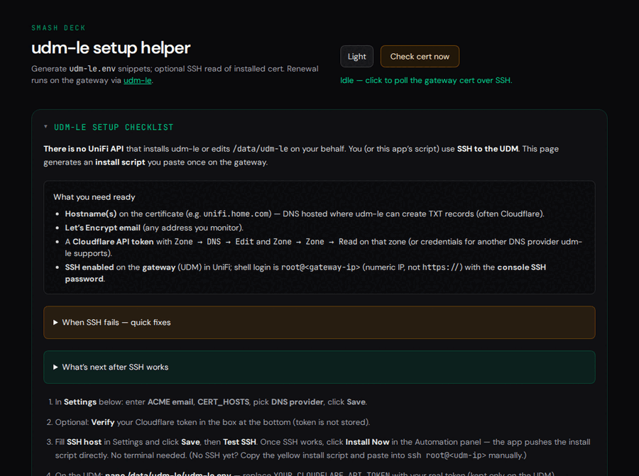

# UniFi Cert Smash Deck

[](https://github.com/niski84/unifi-cert-smash-deck/releases)
[](https://github.com/niski84/unifi-cert-smash-deck/pkgs/container/unifi-cert-smash-deck)
[](https://github.com/niski84/unifi-cert-smash-deck/issues)

**Replace the browser security warning on your UniFi gateway — for good.**

A local web dashboard that walks you through installing a real Let's Encrypt certificate on your UniFi Dream Machine in five steps. After setup, certificates renew automatically every 90 days with zero manual work.

> **Bugs, questions, or feature requests?** [Open an issue](https://github.com/niski84/unifi-cert-smash-deck/issues) — all feedback welcome.



---

## What you get

- **5-step guided wizard** — Connect → Domain → Preflight → Install → Verify. Run once; done.
- **Live cert dashboard** — status ring shows days remaining, last check time, and common name. Auto-refreshes every 12 s.
- **Automatic renewal** — udm-le runs a systemd timer on the UDM itself. No cron jobs on your side.
- **Health API** — `/api/health` returns cert status as JSON for monitoring or scripting.
- **Pre-fills from `.env`** — SSH host, user, key path, Cloudflare token, and more are detected automatically so you're not re-typing things you already have.
- **Secrets stay local** — your DNS token is written directly to the UDM over SSH. It is never saved to disk on this machine.

---

## What you need

| | Requirement | Notes |
|---|---|---|
| 1 | **Domain name** | A domain you control — e.g. `unifi.example.com`. The UDM's LAN IP is fine to use; no port forwarding required. |
| 2 | **DNS managed by a supported provider** | Cloudflare, Route53, DigitalOcean, DuckDNS, Azure, Google Cloud, or Linode. The cert is issued via DNS challenge — no HTTP required. |
| 3 | **DNS API token** | An API token with permission to create TXT records on your domain. It is written to the UDM and never stored here. |
| 4 | **SSH access to the UDM** | UniFi OS → Settings → System → Advanced → SSH → Enable. The user is `root`; the password is the local SSH password shown there (not your Ubiquiti cloud login). |

That's it. The wizard collects everything else.

---

## Quick start

```bash
cd goprojects/unifi-cert-smash-deck
npm install
./scripts/compile.sh
cp .env.example .env   # set PORT, SSH details, and DNS token if you have them
./scripts/reload.sh
```

Open **`http://127.0.0.1:8105/`** — you'll land on the setup wizard if this is your first run.

### Windows

Download the latest `*-windows-amd64-setup.exe` from the [Releases page](https://github.com/niski84/unifi-cert-smash-deck/releases), run it, and follow the installer. It installs the binary to `Program Files`, creates Start Menu shortcuts, and optionally registers a Windows service that starts automatically with Windows.

### Docker

```bash
docker run -d \
  --name unifi-cert-smash-deck \
  --restart unless-stopped \
  -p 8105:8105 \
  -v "$HOME/.ssh:/home/nonroot/.ssh:ro" \
  -v unificert-data:/data \
  ghcr.io/niski84/unifi-cert-smash-deck:latest
```

Settings are stored in the `/data` volume. Pass `.env` variables with `-e` flags or a `--env-file`. SSH keys mounted at `/home/nonroot/.ssh` are accessible as `/home/nonroot/.ssh/id_ed25519` — set `UNIFICERT_SSH_KEY` accordingly.

---

## The 5-step wizard

| Step | What happens |
|------|-------------|
| **1 — Connect** | Enter your UDM's LAN IP and SSH password. The app generates an Ed25519 key pair and deploys it so future operations are passwordless. |
| **2 — Domain** | Enter your Let's Encrypt email, hostname(s), and DNS provider. Paste in your DNS API token. |
| **3 — Preflight** | Automatic checks: can we reach the UDM? Does the DNS token have the right permissions? Passes in seconds if everything looks good. |
| **4 — Install** | One click — SSHes into the UDM, downloads udm-le, writes your config and DNS token directly on the gateway, and kicks off the first cert issuance. |
| **5 — Verify** | Confirms the cert was issued and is readable. Cert info is synced to the dashboard. |

---

## Checking cert health

Once the wizard completes, the dashboard shows a live cert status ring. You can also query the health API directly:

```bash
curl http://127.0.0.1:8105/api/health | jq .
```

```json
{
  "cert_common_name": "unifi.example.com",
  "cert_days_left": 89,
  "cert_expires": "2026-06-27T23:21:09Z",
  "cert_healthy": true,
  "cert_known": true,
  "cert_hosts_configured": true,
  "ssh_host_configured": true,
  "last_check": "2026-03-30T14:10:57Z",
  "last_error": "",
  "service": "unifi-cert-smash-deck"
}
```

The status ring and health API update on every scheduler cycle (default every 12 hours). Click **Check cert now** on the dashboard to force an immediate SSH read.

---

## SSH setup (manual)

If you prefer to handle SSH key deployment yourself rather than using the wizard:

```bash
# Copy your key to the UDM
ssh-copy-id -o PreferredAuthentications=keyboard-interactive,password -i ~/.ssh/id_ed25519.pub root@UDM_IP

# Create a dedicated known_hosts file
ssh-keyscan UDM_IP | grep -v '^#' > ~/.ssh/known_hosts_unifi
```

Then set `UNIFICERT_SSH_KEY` and `UNIFICERT_SSH_KNOWN_HOSTS` in `.env` (or in Settings).

---

## `.env` reference

```bash
PORT=8105
UNIFICERT_SSH_HOST=192.168.1.1          # gateway LAN IP — no https://
UNIFICERT_SSH_USER=root
UNIFICERT_SSH_KEY=/home/you/.ssh/id_ed25519
UNIFICERT_SSH_KNOWN_HOSTS=/home/you/.ssh/known_hosts_unifi
UNIFICERT_SSH_PASSWORD="your-ssh-password"  # temporary; prefer key auth
UNIFICERT_CERT_EMAIL=you@example.com
UNIFICERT_CERT_HOSTS=unifi.example.com
UNIFICERT_DNS_PROVIDER=cloudflare
CLOUDFLARE_DNS_API_TOKEN=your-token-here
```

All settings can also be saved via the web UI (stored in `data/unificert-settings.json`). Values present in `.env` are pre-filled in the wizard automatically — masked for display but ready to use.

The binary also loads `../unifi-smash-deck/.env` before this project's `.env`, so `UNIFI_HOST`, `UNIFI_API_KEY`, and `UNIFI_SITE` can be shared with [UniFi Smash Deck](https://github.com/niski84/unifi-smash-deck).

---

## Changing the poll interval

**Cert check interval (hours)** in Settings controls how often the app reads the cert over SSH. Restart after changing it (`./scripts/reload.sh`).

---

## Security notes

- **DNS token never stored here.** It is written directly to the UDM via SSH (`/data/udm-le/udm-le.env`). The optional Verify field is POST-only and cleared from memory immediately.
- **SSH password never saved to disk.** It is used once to deploy your key, then discarded. Subsequent connections use key auth.
- `data/` holds settings and runtime state — keep it out of untrusted backups.
- UniFi OS upgrades can reset udm-le state. Check the [udm-le README](https://github.com/kchristensen/udm-le/blob/master/README.md) before firmware updates.
- Prefer a **dedicated `known_hosts` file** via `ssh-keyscan` to avoid `knownhosts: key mismatch` errors.

---

## Stack

- **Go** — HTTP server (Echo), SSH/SFTP client, WebSocket log stream
- **Templ** — typed HTML templates
- **HTMX** — partial swaps, form posts
- **Alpine.js** — WebSocket log panel, ephemeral UI state
- **Tailwind CSS 4** — dark-first, `web/styles/input.css` → embedded static

See [docs/HTMX_ALPINE.md](docs/HTMX_ALPINE.md) for UI conventions.

---

## Issues & contributing

Found a bug? Something not working with your UDM model, DNS provider, or SSH setup? **[Open an issue](https://github.com/niski84/unifi-cert-smash-deck/issues)** — include your UDM model, DNS provider, and any error output from the log panel. Pull requests are welcome.
